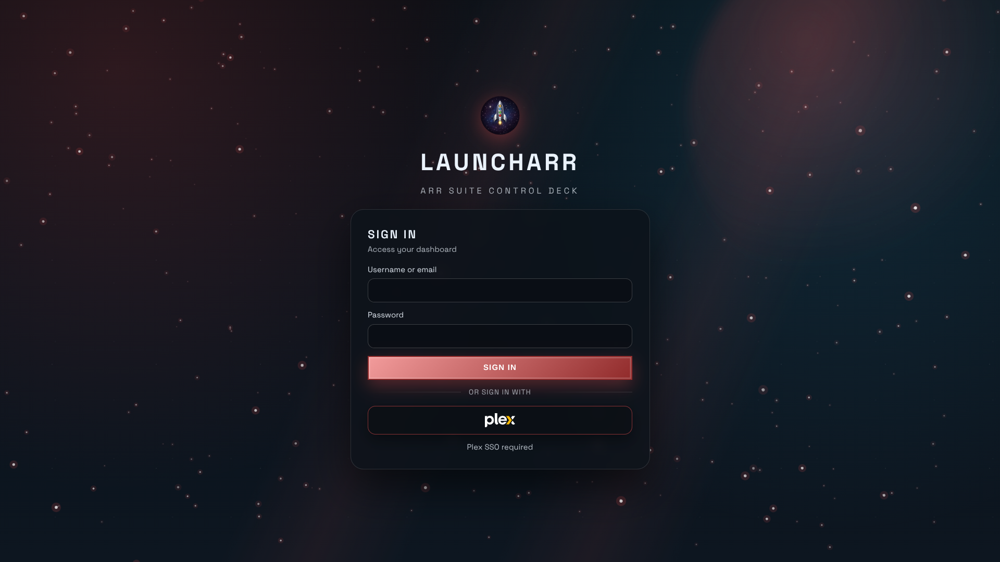
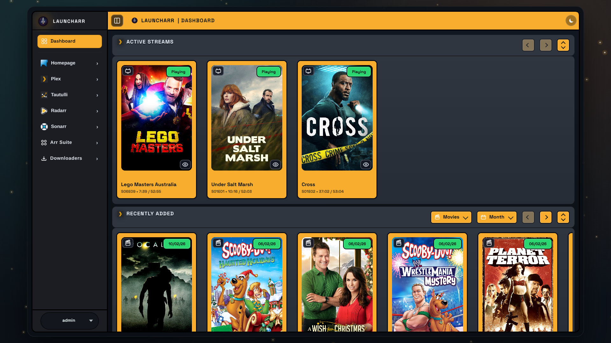
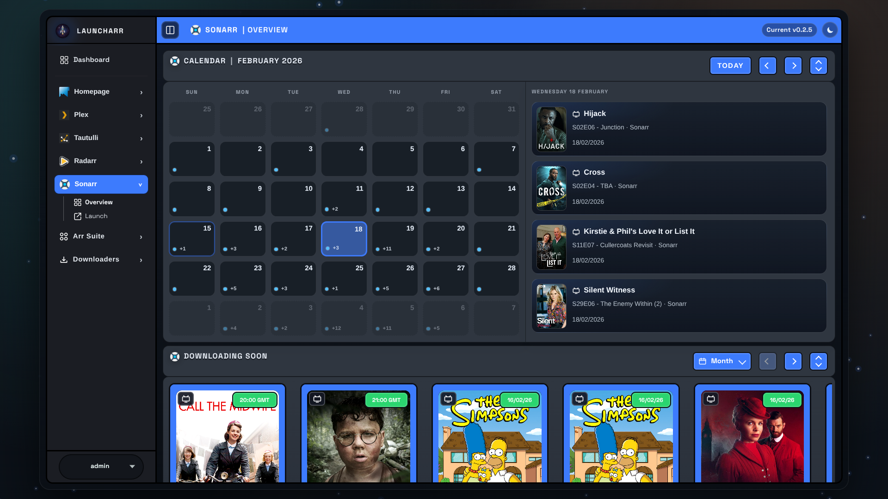
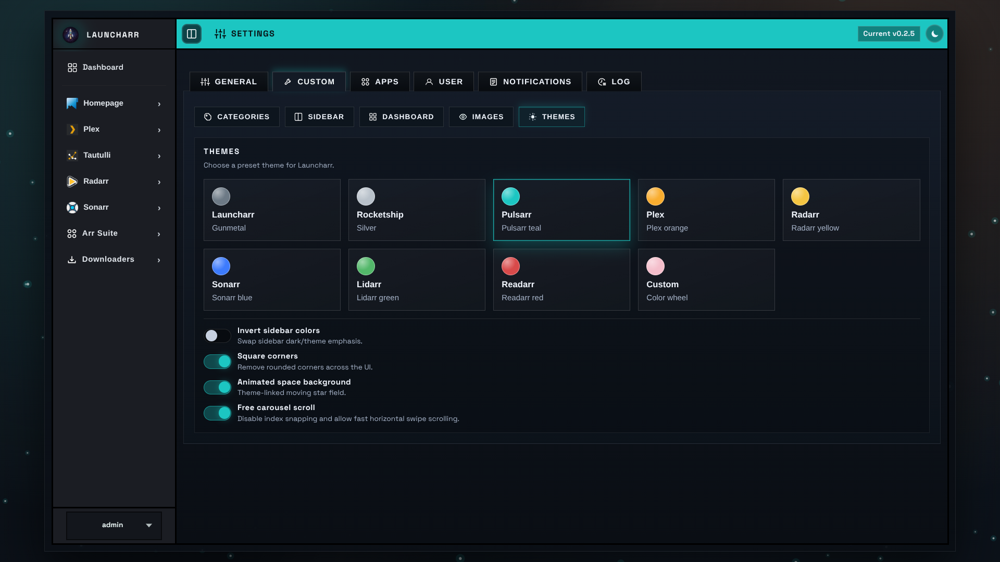
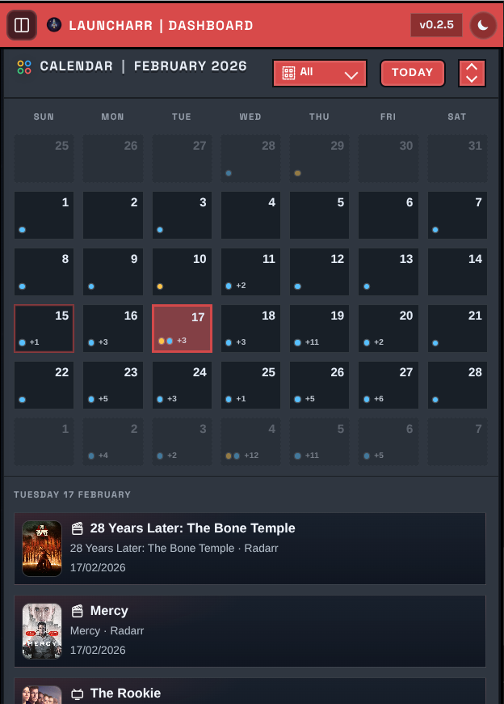

# Launcharr

Launcharr is a Plex-authenticated homepage and control center for the Arr stack, download clients, and companion tools.

It is designed for self-hosted media setups that want one clean entry point with role-aware navigation, integrated overviews, and quick app launch.

## Product Preview


### Login



### Dashboard



### App Overview



### Settings



### Mobile



### Launch Flow (GIF)


## Launch Highlights

- Plex SSO with a local admin fallback account.
- Role-aware access controls (`admin`, `co-admin`, `user`).
- Central dashboard with configurable overview modules.
- Built-in app launch modes (`iframe`, `new-tab`, `disabled`).
- Custom apps, custom categories, and custom icon upload.
- Built-in logs, health check endpoint, and version check endpoint.
- Optional Apprise notifications from Settings.

## Built-in Integrations

Default app catalog shipped in `config/default-apps.json`:

| App | ID | Category | Default URL |
| --- | --- | --- | --- |
| Plex | `plex` | `Media` | `http://localhost:32400/web` |
| Tautulli | `tautulli` | `Manager` | `http://localhost:8181` |
| Radarr | `radarr` | `Arr Suite` | `http://localhost:7878` |
| Sonarr | `sonarr` | `Arr Suite` | `http://localhost:8989` |
| Lidarr | `lidarr` | `Arr Suite` | `http://localhost:8686` |
| Readarr | `readarr` | `Arr Suite` | `http://localhost:8787` |
| Bazarr | `bazarr` | `Arr Suite` | `http://localhost:6767` |
| Prowlarr | `prowlarr` | `Arr Suite` | `http://localhost:9696` |
| Pulsarr | `pulsarr` | `Arr Suite` | `http://localhost:3030` |
| Seerr | `seerr` | `Arr Suite` | `http://localhost:5055` |
| Cleanuparr | `cleanuparr` | `Arr Suite` | `http://localhost:11011` |
| Huntarr | `huntarr` | `Arr Suite` | `http://localhost:9705` |
| Transmission | `transmission` | `Downloaders` | `http://localhost:9091` |
| NZBGet | `nzbget` | `Downloaders` | `http://localhost:6789` |

## Quick Start

### Docker Run

```bash
docker run -d \
  --name=launcharr \
  --restart unless-stopped \
  -p 3333:3333 \
  -e CONFIG_PATH=/app/config/config.json \
  -e DATA_DIR=/app/data \
  -e PUID=1000 \
  -e PGID=100 \
  -e TZ=Etc/UTC \
  -v ./config:/app/config \
  -v ./data:/app/data \
  -v ./data/icons/custom:/app/public/icons/custom \
  mickygx/launcharr:development
```

### Docker Compose

```yaml
services:
  launcharr:
    container_name: launcharr
    image: mickygx/launcharr:development
    ports:
      - "3333:3333"
    environment:
      - CONFIG_PATH=/app/config/config.json
      - DATA_DIR=/app/data
      - PUID=1000
      - PGID=100
      - TZ=Etc/UTC
    volumes:
      - ./config:/app/config
      - ./data:/app/data
      - ./data/icons/custom:/app/public/icons/custom
    restart: unless-stopped
```

```bash
docker compose up -d
```

Open `http://localhost:3333`.

## First-Run Flow

1. Open Launcharr and create the local fallback admin on `/setup`.
2. Sign in and open `Plex -> Settings`.
3. Set Plex local/remote URL values, then use `Get Plex Token` and `Get Plex Machine`.
4. Save, log out, then sign back in with Plex SSO.
5. In `Settings`, tune role access, menu visibility, and overview modules.

Notes:
- If no Plex admin list exists yet, the first Plex account that signs in is promoted to owner admin.
- Role ownership and promotions are persisted in `data/admins.json` and `data/coadmins.json`.

## Environment Variables

Common:

| Variable | Default | Purpose |
| --- | --- | --- |
| `PORT` | `3333` | HTTP listen port. |
| `CONFIG_PATH` | `config/config.json` | Main config override file. |
| `DATA_DIR` | `data/` | Runtime data (admins, logs, Plex keys/client id). |
| `SESSION_SECRET` | `change-me` | Cookie-session secret. Set this in production. |
| `COOKIE_SECURE` | unset (`false`) | Set `true` behind HTTPS. |
| `BASE_URL` | `http://localhost:<PORT>` | Base URL fallback for callback/link generation. |
| `ADMIN_USERS` | empty | Comma-separated bootstrap admins. |
| `APP_VERSION` | package version | Version badge/API value. |

Plex client identity overrides:

- `PLEX_CLIENT_ID`
- `PLEX_PRODUCT`
- `PLEX_PLATFORM`
- `PLEX_DEVICE_NAME`

## Configuration and Storage

- `config/default-apps.json`: shipped app defaults.
- `config/default-categories.json`: shipped category defaults.
- `config/config.json`: saved overrides/customizations.
- `data/admins.json`: owner/admin identities.
- `data/coadmins.json`: co-admin identities.
- `data/logs.json`: persisted UI/server logs.
- `data/plex_client_id.txt`: generated Plex client identifier.
- `data/plex_private.pem` + `data/plex_public.json`: Plex device keys for SSO flow.

## Reverse Proxy (Traefik)

Use `docker-compose.traefik.example.yml` as a template and replace:

- `launcharr.example.com` with your domain.
- TLS resolver/network values with your environment.

Set `Settings -> General -> Remote URL` to your public URL so Plex callback and external links resolve correctly.

## Operations Endpoints

- `GET /healthz` -> liveness check.
- `GET /api/version` -> current vs latest Docker tag.
- `GET /api/logs` -> runtime logs (authenticated).

## Troubleshooting Quick Hits

- Login redirect loops:
  - Set a real `SESSION_SECRET`.
  - If running HTTPS behind a proxy, set `COOKIE_SECURE=true`.
- Plex callback fails:
  - Ensure `Settings -> General -> Remote URL` is set correctly.
  - Re-run `Get Plex Token` and `Get Plex Machine`.
- Access denied for pages/widgets:
  - Confirm app menu permissions and user role assignment.
- Reset Plex identity material:
  - Remove `data/plex_private.pem`, `data/plex_public.json`, and `data/plex_client_id.txt`, then restart.

## Wiki Content

Launch-ready wiki source files are included in `docs/wiki/`.

Start with:

- `docs/wiki/Home.md`
- `docs/wiki/Quick-Start.md`
- `docs/wiki/Configuration.md`
- `docs/wiki/Authentication-and-Roles.md`
- `docs/wiki/Integrations.md`
- `docs/wiki/Troubleshooting.md`
- `docs/wiki/FAQ.md`
- `docs/wiki/Release-Checklist.md`
