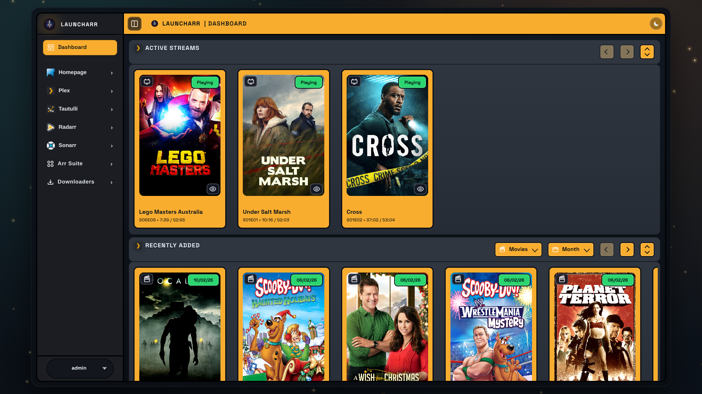

<p align="center">
  
</p>
<h3 align="center">LAUNCHARR</h3>
<p align="center"><sub>PLEX-AUTHENTICATED HOMEPAGE FOR THE ARR STACK</sub></p>
<p align="center">
  <a href="https://github.com/MickyGX/launcharr/releases/latest"></a>
  <a href="https://discord.gg/TvrxJWD4PK"></a>
  <a href="https://www.gnu.org/licenses/agpl-3.0.en.html"></a>
  <a href="https://hub.docker.com/r/mickygx/launcharr"></a>
</p>
<p align="center">
  <a href="https://ko-fi.com/U7U61X81Z1" target="_blank"></a>
  <a href="https://www.buymeacoffee.com/MickyGX"></a>
</p>
<hr />

Launcharr is a self-hosted, Plex-authenticated homepage and control center for the Arr stack, download clients, and companion tools.

## Preview



## What It Does

- Central dashboard for your Plex + Arr + downloader stack
- Plex SSO with local fallback admin account
- Role-aware access (`admin`, `co-admin`, `user`) with guest visibility controls
- Per-app launch modes (`iframe`, `new-tab`, `disabled`)
- Built-in catalog of 48 opt-in app integrations plus custom apps and categories
- Multi-dashboard layouts with widget bars and stat cards
- Optional Apprise notifications including widget status monitoring

## Quick Start

```yaml
services:
  launcharr:
    image: mickygx/launcharr:latest
    container_name: launcharr
    ports:
      - "3333:3333"
    environment:
      - CONFIG_PATH=/app/config/config.json
      - DATA_DIR=/app/data
      - BASE_URL=http://localhost:3333
      - TRUST_PROXY=true
      - TRUST_PROXY_HOPS=1
      # Generate once: openssl rand -hex 32
      - SESSION_SECRET=replace-this-with-a-random-secret
      # Set based on how you access Launcharr:
      # Plain HTTP (local IP, no TLS proxy): COOKIE_SECURE=false
      # HTTPS only (reverse proxy with cert): COOKIE_SECURE=true
      - COOKIE_SECURE=false
    volumes:
      - ./config:/app/config
      - ./data:/app/data
      - ./data/icons/custom:/app/public/icons/custom
    restart: unless-stopped
```

```bash
docker compose up -d
```

Then open `http://localhost:3333` and complete setup.

## Documentation

- [GitHub Wiki](https://github.com/MickyGX/launcharr/wiki)
- [Wiki Home](docs/wiki/Home.md)
- [Quick Start](docs/wiki/Quick-Start.md)
- [Configuration](docs/wiki/Configuration.md)
- [Authentication and Roles](docs/wiki/Authentication-and-Roles.md)
- [Integrations](docs/wiki/Integrations.md)
- [Supported Apps](docs/wiki/Supported-Apps.md)
- [Troubleshooting](docs/wiki/Troubleshooting.md)
- [FAQ](docs/wiki/FAQ.md)

## Support

- [Discord](https://discord.gg/TvrxJWD4PK)
- [GitHub Discussions](https://github.com/MickyGX/launcharr/discussions)
- [GitHub Wiki](https://github.com/MickyGX/launcharr/wiki)
